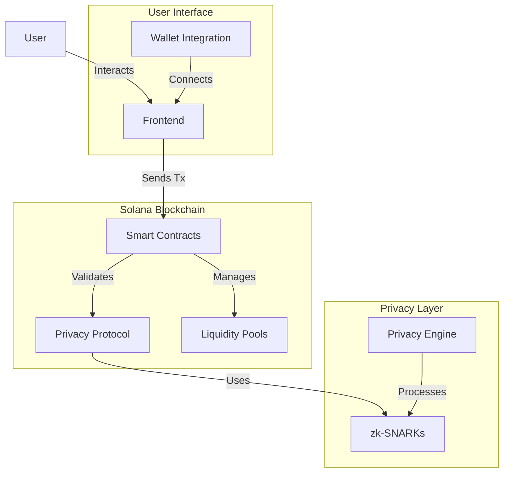
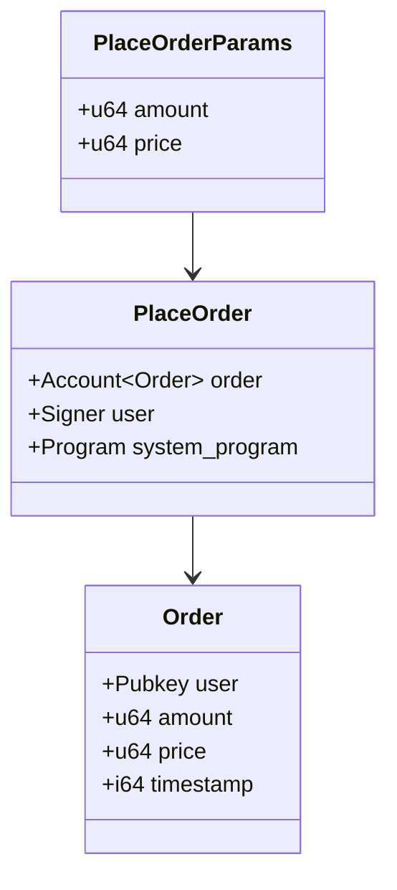
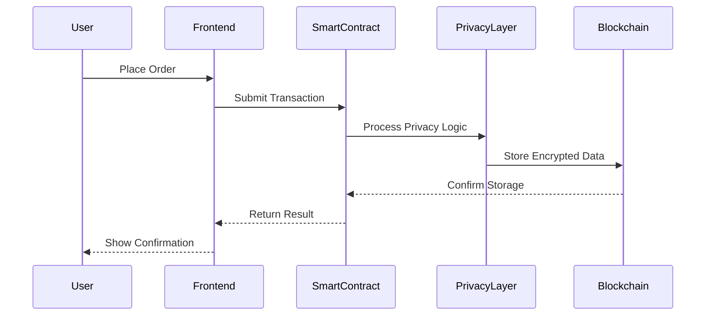
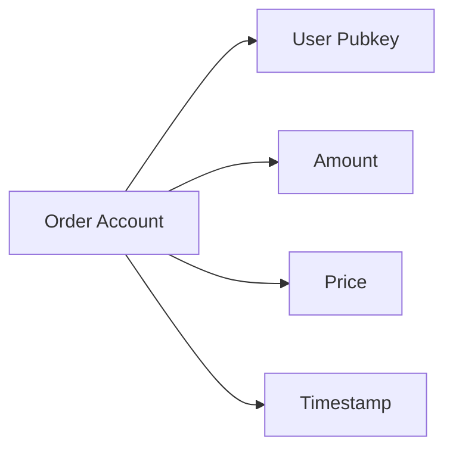
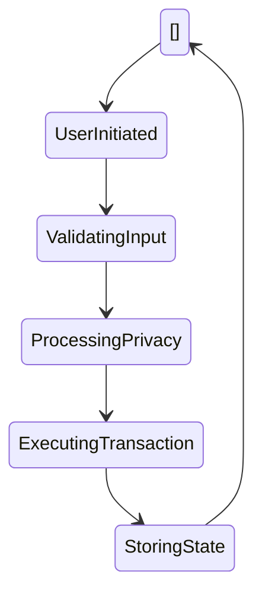
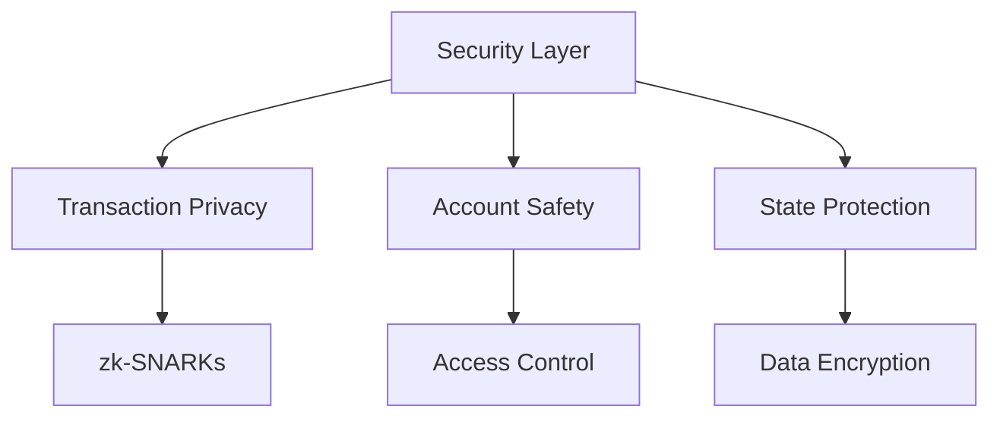
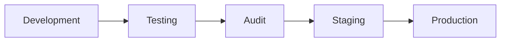

# Privacy-Focused DEX on Solana

## Project Overview

This project implements a privacy-focused Decentralized Exchange (DEX) on the Solana blockchain, leveraging zero-knowledge proofs for transaction privacy while maintaining the high performance characteristics of Solana.

## System Architecture

## Core Components

### Smart Contracts (`contracts/src/smart_contracts.rs`)

#### Implemented Features:
- Order placement with privacy preservation
- Account management for orders
- Basic liquidity pool structure (pending implementation)

### Program Flow

## Current Implementation Status

### Completed Components ✅

1. **Smart Contract Infrastructure**
   - Order placement functionality
   - Account structures
   - Basic transaction flow

2. **Testing Framework**
   - Unit tests for order placement
   - Test environment configuration
   - Transaction validation tests

### In Progress 🚧

1. **Privacy Layer**
   - Integration of zk-SNARKs
   - Transaction data encryption
   - Private state transitions

2. **Liquidity Pool Management**
   - Pool state management
   - Automated market making
   - Price discovery mechanism

## Technical Details

### Account Structure

### Transaction Flow

## Testing Strategy

### Unit Tests
- Order placement validation
- Account state verification
- Transaction processing checks

### Integration Tests (Planned)
- End-to-end transaction flow
- Privacy mechanism validation
- Liquidity pool interactions

## Security Considerations

## Next Development Phases

1. **Phase 1: Privacy Enhancement**
   - Implement full zk-SNARK integration
   - Add transaction privacy features
   - Enhance state encryption

2. **Phase 2: Liquidity Management**
   - Complete liquidity pool implementation
   - Add automated market making
   - Implement price discovery

3. **Phase 3: User Interface**
   - Develop frontend components
   - Add wallet integration
   - Implement transaction monitoring

## Development Guidelines

### Code Structure
- Modular design pattern
- Clear separation of concerns
- Comprehensive documentation

### Testing Requirements
- Unit test coverage > 80%
- Integration test suite
- Performance benchmarking

## Deployment Strategy

## Contributing

Guidelines for contributing to the project:
1. Follow Rust best practices
2. Maintain test coverage
3. Document all changes
4. Submit detailed PRs

---

*Last Updated: 2024-11-01*
*Status: Active Development*
