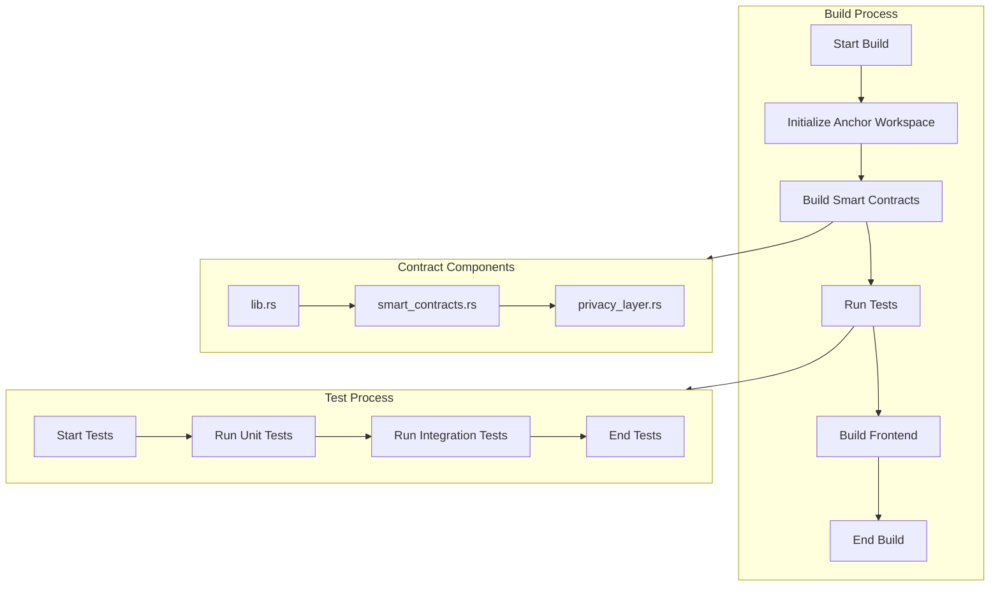

# Build and Test Process Flow

```mermaid
graph TB
    subgraph BuildProcess["Build Process"]
        Start[Start Build]
        Init[Initialize Anchor Workspace]
        BuildSC[Build Smart Contracts]
        RunTests[Run Tests]
        BuildFE[Build Frontend]
        End[End Build]
        
        Start --> Init
        Init --> BuildSC
        BuildSC --> RunTests
        RunTests --> BuildFE
        BuildFE --> End
    end

    subgraph TestProcess["Test Process"]
        TestStart[Start Tests]
        UnitTests[Run Unit Tests]
        IntTests[Run Integration Tests]
        TestEnd[End Tests]
        
        TestStart --> UnitTests
        UnitTests --> IntTests
        IntTests --> TestEnd
    end

    subgraph ContractComponents["Contract Components"]
        Lib[lib.rs]
        SmartContracts[smart_contracts.rs]
        Privacy[privacy_layer.rs]
        
        Lib --> SmartContracts
        SmartContracts --> Privacy
    end

    BuildSC --> ContractComponents
    RunTests --> TestProcess
```