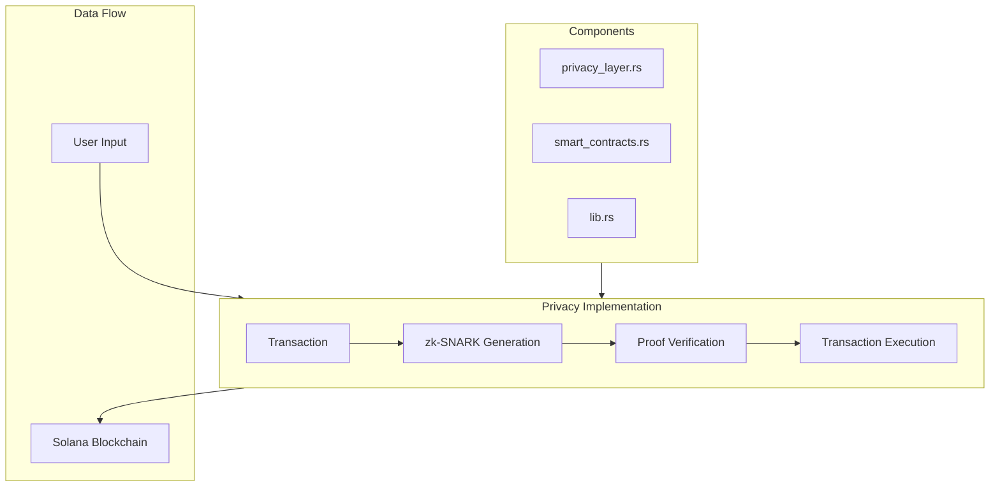

# Privacy Layer Implementation

```mermaid
graph TB
    subgraph PrivacyImpl["Privacy Implementation"]
        TX[Transaction]
        ZK[zk-SNARK Generation]
        Proof[Proof Verification]
        Execution[Transaction Execution]
        
        TX --> ZK
        ZK --> Proof
        Proof --> Execution
    end

    subgraph ComponentsGroup["Components"]
        PL[privacy_layer.rs]
        SC[smart_contracts.rs]
        Lib[lib.rs]
    end

    subgraph DataFlow["Data Flow"]
        Input[User Input]
        Blockchain[Solana Blockchain]
    end

    Input --> PrivacyImpl
    PrivacyImpl --> Blockchain
    ComponentsGroup --> PrivacyImpl
``` 