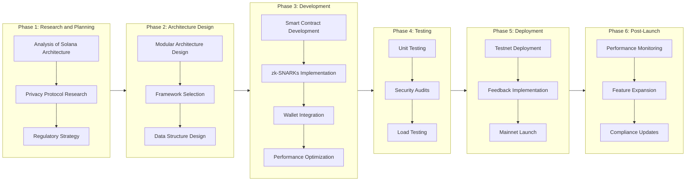
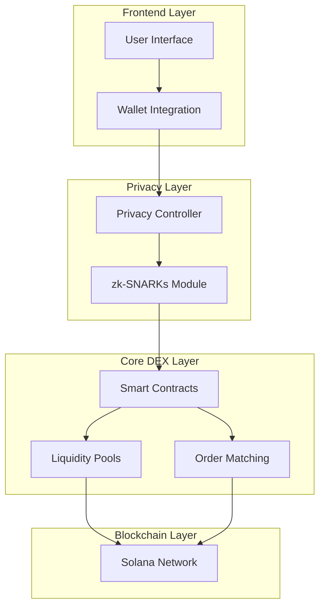
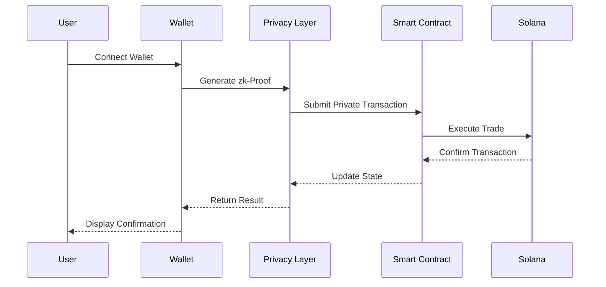
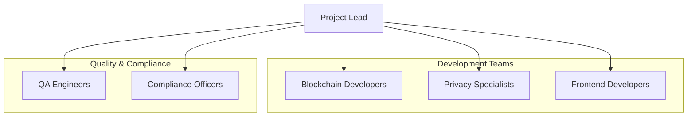
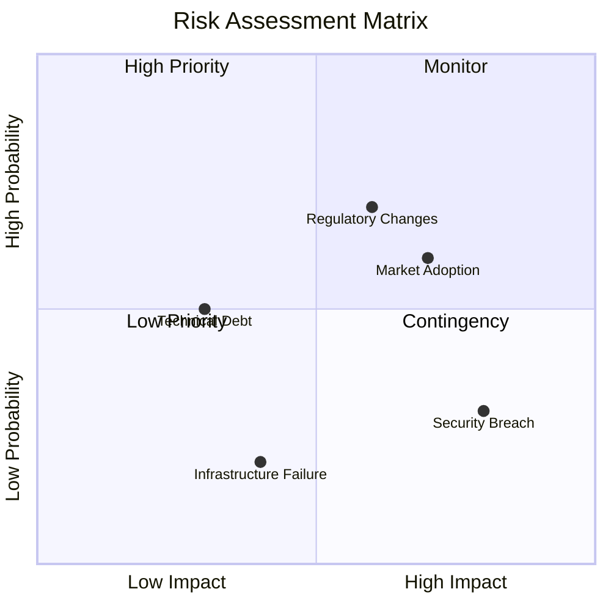

# Project Plan: Privacy-Focused DEX on Solana

## Overview

Design and build a high-performance, privacy-focused decentralized exchange (DEX) on the Solana blockchain. Leverage Solana’s speed and Rust’s strengths in concurrency, safety, and performance to create a secure, scalable, and user-friendly platform.

## Objectives

- **High Performance**: Utilize Solana's high throughput to handle a large volume of transactions with minimal latency.
- **Privacy-Preserving**: Integrate zero-knowledge proofs (zk-SNARKs) to ensure transaction privacy without compromising security.
- **Security**: Implement robust cryptographic protections and secure transaction validation mechanisms.
- **Scalability**: Design for future growth and adaptability in the evolving blockchain landscape.
- **Regulatory Compliance**: Balance privacy features with legal requirements for decentralized finance platforms.

## Phases and Milestones

### Phase 1: Research and Planning

- **Milestone 1**: Conduct an in-depth analysis of Solana's architecture and Rust programming paradigms.
- **Milestone 2**: Research privacy-preserving protocols suitable for Solana, focusing on zk-SNARKs.
- **Milestone 3**: Outline regulatory considerations and compliance strategies for DeFi platforms.

### Phase 2: Architecture Design

- **Milestone 1**: Define the modular architecture of the DEX, including smart contracts, liquidity pools, and wallet integration.
- **Milestone 2**: Select appropriate Rust libraries and Solana-specific frameworks like Anchor for efficient development.
- **Milestone 3**: Design data structures and concurrency models utilizing Rust's async functions and parallel processing capabilities.

### Phase 3: Development

- **Milestone 1**: Develop smart contracts using Rust and Anchor, focusing on asset trading and liquidity pool functionalities.
- **Milestone 2**: Implement zk-SNARKs for transaction privacy, integrating Rust libraries that support zero-knowledge proofs.
- **Milestone 3**: Integrate wallet support, ensuring seamless user interactions with popular Solana wallets.
- **Milestone 4**: Optimize the codebase for performance, safety, and maintainability, adhering to Rust and blockchain best practices.

### Phase 4: Testing and Security Audits

- **Milestone 1**: Conduct unit and integration testing to ensure all components function correctly.
- **Milestone 2**: Perform security audits, focusing on smart contracts and cryptographic implementations.
- **Milestone 3**: Test the DEX under simulated high-load conditions to assess performance and scalability.

### Phase 5: Deployment

- **Milestone 1**: Deploy the DEX on Solana's testnet for beta testing and community feedback.
- **Milestone 2**: Implement feedback and fix any identified issues.
- **Milestone 3**: Launch on Solana's mainnet, ensuring all privacy and security features are fully operational.

### Phase 6: Post-Launch Support and Expansion

- **Milestone 1**: Monitor platform performance and address any arising issues promptly.
- **Milestone 2**: Plan for additional features such as governance tokens, staking, or cross-chain integrations.
- **Milestone 3**: Stay updated with regulatory changes and adjust compliance mechanisms accordingly.

## Technical Stack

- **Programming Language**: Rust
- **Frameworks**: Anchor for Solana smart contract development
- **Privacy Libraries**: zk-SNARKs implementation libraries compatible with Rust
- **Data Handling**: Utilize efficient data structures and async functions in Rust for optimal performance
- **Concurrency**: Leverage Rust's concurrency models to handle parallel processing tasks

## Key Components

- **Smart Contracts**: Core functionalities for trading, liquidity pools, and fee distribution
- **Privacy Layer**: Integration of zk-SNARKs to conceal transaction details without sacrificing security
- **Wallet Integration**: Compatibility with Solana wallets like Phantom and Solflare
- **User Interface**: Design a user-friendly interface that abstracts complexity and enhances user experience

## Best Practices

- **Modularization**: Keep the codebase modular for ease of maintenance and scalability
- **Security Protocols**: Follow industry-standard security practices, including secure coding standards and regular audits
- **Performance Optimization**: Continuously profile and optimize the code to reduce latency and handle high throughput
- **Documentation**: Maintain thorough documentation for developers and users

## Risk Management

- **Security Risks**: Mitigate through comprehensive testing and third-party audits
- **Regulatory Risks**: Stay informed about DeFi regulations and implement necessary compliance features
- **Technical Risks**: Address potential scalability challenges with robust architectural planning

## Future Considerations

- **Scalability Enhancements**: Explore sharding or layer-2 solutions as the user base grows
- **Cross-Chain Compatibility**: Investigate interoperability with other blockchains
- **Community Governance**: Plan for decentralized governance mechanisms to involve the community in decision-making

## Project Timeline Visualization

## System Architecture

## Component Interaction Flow

## Team Organization

## Risk Assessment Matrix

